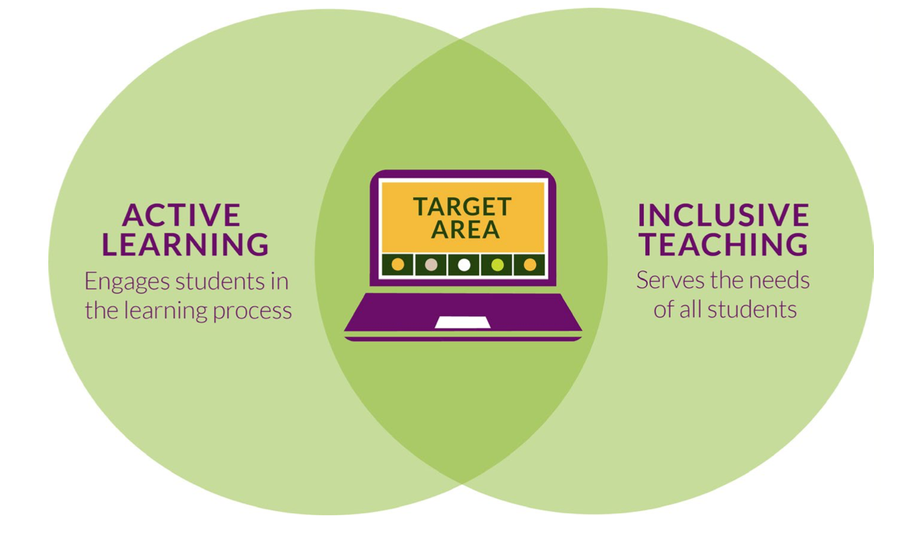

# Tentative PM Schedule

### All registration handled through the main [Evolution 2021 website](https://www.evolutionmeetings.org/registration.html).

**Afternoon Session 1 - From Panic to Pedagogy: Making the lessons of the past year last**

In March of 2020, many educators found themselves in an emergency, needing to take courses (including labs) online. But in this upheaval was an opportunity to refocus on what is important in our classrooms, and to recenter student outcomes in our approaches to learning. In this session, we will discuss some tenants of active learning and inclusive pedagogy and relate them to teaching computation to biologists. Drs. Breanna Harris and April Wright will present some lessons learned from their classrooms, and from writing their recent manuscript ["From Panic to Pedagogy: Using online active learning to promote inclusive instruction in ecology and evolutionary biology courses."](https://onlinelibrary.wiley.com/doi/10.1002/ece3.6915)

**Afternoon Session 2 -  Coding to learn, not learning to code**

 In this session, we will discuss scaffolding computation into courses that aren't inherently computational themselves. For example, using R to process camera trap data in a mammalogy course, or using population genetic simulations in evolution. What are the major challenges to doing this? Is domain knowledge lost?

  Interested parties are welcome to enter their course to be showcased during this session. A showcase will be a 5-minute discussion of what you're doing in your class to code-to-learn. If interested, please open an issue on our [GitHub page](https://github.com/ievobio/2021iEvoBio/issues).

**Afternoon mixer:** Course-based breakouts. We'll form breakouts to discuss topics from the afternoon sessions.
